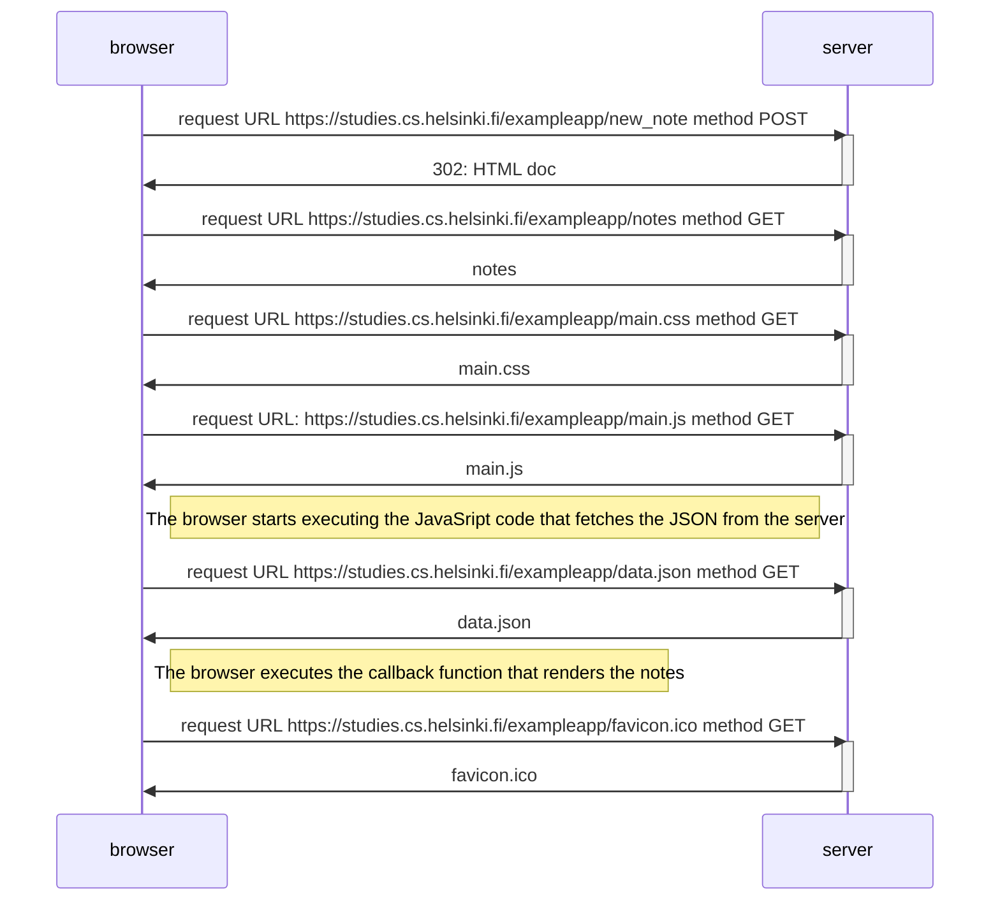

```mermaid
sequenceDiagram
  participant browser
  participant server
  
  browser->>server: request URL https://studies.cs.helsinki.fi/exampleapp/new_note method POST
  activate server
  server->>browser: 302: HTML doc
  deactivate server
  
  browser->>server: request URL https://studies.cs.helsinki.fi/exampleapp/notes method GET
  activate server
  server->>browser: notes
  deactivate server
  
  browser->>server: request URL https://studies.cs.helsinki.fi/exampleapp/main.css method GET
  activate server 
  server->>browser: main.css
  deactivate server
  
  browser->>server: request URL: https://studies.cs.helsinki.fi/exampleapp/main.js method GET
  activate server
  server->>browser: main.js
  deactivate server
  
  Note right of browser: The browser starts executing the JavaSript code that fetches the JSON from the server
  
  browser->>server: request URL https://studies.cs.helsinki.fi/exampleapp/data.json method GET
  activate server
  server->>browser: data.json
  deactivate server
  
  Note right of browser: The browser executes the callback function that renders the notes

  
  browser->>server: request URL https://studies.cs.helsinki.fi/exampleapp/favicon.ico method GET
  activate server
  server->>browser: favicon.ico
  deactivate server
```
